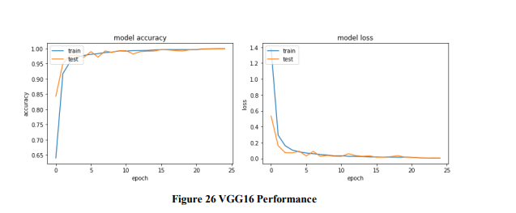

# Plant-Disease-Detection-using-Deep-Learning

Developed a web application to detect plant diseases through image processing using CNN model.

This is my thesis work in my Master's

In this study, I have implemented a CNN models to detect and classify the plant diseases from their leaves.

I have trained these models using the public dataset called [plant village](https://www.kaggle.com/abdallahalidev/plantvillage-dataset) which consists of 543000 images with 14 crop spices and 26 disease classes. In first approach 

I implemented pretrained models such as Densenet121, Resnet101, Inception V3, Mobilenet and VGG16.

In my second approach I implemented and trained 3 custom CNN models from scratch. 

All these implemented models have performed exceptionally well. Out of all the CNN models VGG16 has achieved higher validation accuracy of 99.84% which has not been seen in the previous works related to the plant disease detection. 

Furthermore a web application based on this VGG16 has been developed to identify the plant diseases

##### Research Question:
How well does various deep convolutional neural networks perform in detecting the plant diseases 
##### Objectives
The project's key aims and objectives are listed below:
* Design and implement multiple CNN models for detecting plant diseases.
* Evaluating and comparing the accuracy of each model.
* Develop an application based on the proposed model.

#### The Accuracy table of all the models 

#### The performance of VGG16:
This Model has achieved the highest training accuracy and testing accuracies which are 0.9993 and 0.9984, The graphs are also evident as the plots for both train data and test data are closely located. This model is trained with no overfitting and underfitting. Model loss(categorical cross entropy ) and accuracy are shown in thebelow figures

## web Application
I have developed a web application that can classify the leaf disease. The model that has achieved higher accuracy among all other model has be used to classify the leaf disease.

When user uploads an image of leaf, the application automatically detects and classify the image based on the 39 classes of image that the model has been trained. 

The application also provides the top 3 probable diseases that matches with the input image provided by the user. 

The figure below shows the working of web application with top three probable classes of diseases. 

![application][images/application.PNG)

Here I can observe that Corn cercospora leaf spot has the highest percentage which is 0.99 and the remaining other two class percentage where in negative notations.

### SET-UP
* Run the notebook, A model output file with .h5 will be generated
* use the generated model in python script
* run the python script in launch the application in local server using flask.
